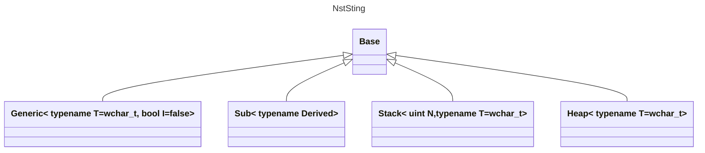

```mermaid
---
title: NstSting
---
classDiagram
class Generic["Generic< typename T=wchar_t, bool I=false>"]

Base <|-- Generic

class Sub["Sub< typename Derived>"]
Base <|-- Sub

class Stack["Stack< uint N,typename T=wchar_t>"]

Base <|-- Stack

class Heap["Heap< typename T=wchar_t>"]

Base <|-- Heap
```